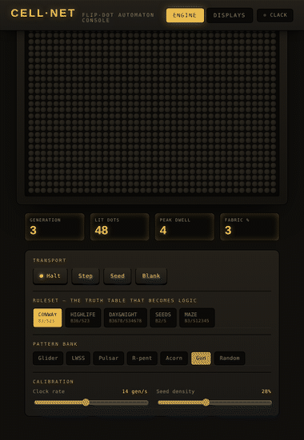

# Massively Parallel Cellular Automaton Engine

I'm building a cellular automaton engine meant to run natively in parallel
hardware, where every cell is its own independent logic unit updating
simultaneously on a single clock edge, with a real electromechanical
flip-dot display as the endgame output.



## Why an FPGA, specifically

A cellular automaton's update rule is embarrassingly parallel almost by
accident: a cell's next state only ever depends on itself and its eight
neighbors. Run that on a CPU or GPU and you're still visiting every cell
sequentially, just in bigger or smaller batches. An FPGA lets you do
something a CPU structurally can't: write the rule as combinational logic
once, then stamp that same logic block down once per cell across the whole
fabric. Every cell updates on the same clock edge. Not "very fast" — at
once.

That's the actual argument for using an FPGA here instead of reaching for
a microcontroller or a GPU.It's that the hardware fabric itself is built the same way the problem is shaped.

The flip-dot display carries that same idea one step further into the
physical world. Each pixel is a tiny bistable electromagnetic disc — one
coil per cell, holding its state with zero standing power once flipped.
It's a mechanical version of the exact same "one independent unit per
cell" principle the compute side is built on, which is the real reason
I want this project to end at flip-dots and not an LED matrix.

## Phase 1 — software prototype + parallelism benchmark

`software_prototype/cellnet_console.html` is a single self-contained HTML
file, no dependencies, no build step. Open it in a browser and that's the
whole thing. What's actually in it:

The core update rule, `update(alive, neighbors)`, is written as a pure
function of local state only — no grid access, no shared variables — on
purpose, because that function signature is exactly what becomes one
Verilog module once this moves to hardware. Around that rule sits five
selectable rulesets (Conway, HighLife, Day & Night, Seeds, Maze), each one
a genuinely different truth table and therefore different combinational
logic to eventually synthesize. There's a pattern bank — glider, LWSS,
pulsar, R-pentomino, acorn, Gosper glider gun — plus free-draw if you want
to seed something by hand. Visually it's built to look and feel like a
flip-dot operator's console: dots physically squash-flip when they change
state, and there's an optional synthesized "clack" per generation, scaled
to how many cells actually flipped. A separate Displays tab surveys real
physical output media — flip-dot, split-flap, VFD, Nixie, LED matrix —
with honest notes on how an FPGA would actually drive each one, not just
which looks coolest.

Sitting alongside the console is `software_prototype/parallelism_ladder/`,
which takes the exact same CA rule and benchmarks it across five different
software substrates — naive Python threads, NumPy, multiprocessing, Numba
— specifically to show what "parallel" does and doesn't mean once you're
still running on a CPU, GIL included. That comparison matters precisely
because it's the baseline the FPGA fabric eventually gets measured against.
Full results and methodology live in that folder's own README.

## Roadmap

| Phase | Goal | Status |
|---|---|---|
| 1 | Software prototype — rule + visual target nailed down | ✅ done |
| 2 | `ca_cell.v` — one cell's update rule as combinational Verilog, testbenched in isolation | ⏳ next |
| 3 | Parallel fabric — 2D `generate` block instantiating `ca_cell` across the grid, wired to 8 neighbors with toroidal wraparound, one shared clock | planned |
| 4 | UART streaming of live grid state off-chip to a PC visualizer | planned |
| 5 | Flip-dot driver stage — swap the output from UART/PC to real coil-driven hardware | planned |
| 6 | Novelty extension — continuous-state rule (Lenia-style) or a second competing species (predator/prey) | stretch |

## Repo structure

```
ca-fpga-engine/
├── README.md
├── software_prototype/
│   ├── cellnet_console.html      # Phase 1 — the console
│   └── parallelism_ladder/       # Phase 1.5 — GIL/parallelism benchmark suite
├── hardware/                     # Phase 2+ — Verilog lands here
├── docs/
│   └── media/
│       └── cellnet_demo.gif
└── LICENSE
```

## Motivation

This is the second-year step up from an FPGA MNIST inference accelerator I
built earlier — that project proved a pipeline could run on an FPGA at
all. This one is about actually using an FPGA for the thing it's uniquely
good at: real fine-grained parallelism, pointed at a physical output medium
that was built on the same idea.

## Author

Saikarthik Ramakrishnan — ECE, Shiv Nadar University Delhi.
