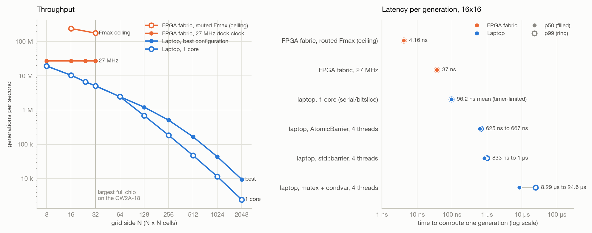

# Performance Evaluation: Laptop and FPGA

This document compares the throughput and latency of the FPGA fabric with a multithreaded C++20 engine running on a laptop.

## Method

- The laptop baseline is the C++ engine in [`software_prototype/cpp`](../software_prototype/cpp/README.md), running on an Apple M2 Pro with six performance cores and four efficiency cores. Its fastest kernel packs 64 cells into each machine word.
- Each laptop figure is the median of five timed runs, and each run is checked against the reference model before it is timed.
- The FPGA figures come from cycle-accurate simulation of the complete chip. The simulation counts clock cycles exactly, and the counts are converted to time at the 27 MHz board clock. The physical board has not yet been measured.
- The routed Fmax figures are the post-route timing limits of the fixed-rule build. The board runs at 27 MHz, so they describe the headroom of the fabric and would require a faster clock source to realize.

<picture>
  <source media="(prefers-color-scheme: dark)" srcset="../software_prototype/cpp/results/laptop_vs_fpga_dark.png">
  
</picture>

## Throughput

| Grid | Best laptop | FPGA at 27 MHz | FPGA at routed Fmax |
|---|---|---|---|
| 8x8 | 19.3 M gen/s | 27 M gen/s (1.4x) | not routed |
| 16x16 | 10.4 M gen/s | 27 M gen/s (2.6x) | 240 M gen/s (23x) |
| 24x24 | 6.72 M gen/s | 27 M gen/s (4.0x) | not routed |
| 32x32 | 5.10 M gen/s | 27 M gen/s (5.3x) | 176 M gen/s (35x) |
| 64x64 to 2048x2048 | 2.47 M to 9.46 k gen/s | does not fit | does not fit |

- The fabric completes one generation per clock at every size it can hold. This was measured over 64 consecutive generations at 8x8, 16x16, 24x24 and 32x32.
- The laptop slows as the grid grows while the fabric keeps a constant rate, so the advantage widens with size, from 1.4x to 5.3x at the board clock.
- The laptop has the advantage in capacity. Grids larger than 32x32 do not fit on this FPGA, while six laptop cores reach 3.9 times the single-core rate at 2048x2048.

## Latency

| 16x16 | p50 | p99 |
|---|---|---|
| FPGA fabric at 27 MHz | 37 ns | 37 ns |
| Laptop, one core | 96 ns (mean) | limited by timer resolution |
| Laptop, four threads with an atomic barrier | 625 ns | 667 ns |
| Laptop, four threads with a mutex barrier | 8.29 µs | 24.6 µs |

- The fabric takes exactly one clock cycle for every generation, with no variation between generations.
- The laptop's latency varies from run to run. Its best threaded configuration at 16x16 has a p99.9 about 17 times its median.
- The serial link determines the end-to-end latency of the board. Reporting one frame at 115200 baud takes 2.86 ms, compared with 37 ns to compute a generation.

## Note on Earlier Figures

An earlier version of this comparison used the Numba tier of the Python benchmark as the software baseline and reported speedups of 195x at 16x16 and 408x at 32x32. The bit-sliced C++ engine is about 75 times faster per core than that tier, and the figures above replace the earlier ones.

## Further Detail

- Complete tables, including the serial link timing: [`laptop_vs_fpga.md`](../software_prototype/cpp/results/laptop_vs_fpga.md)
- The cost of each synchronization method: [`CONCURRENCY.md`](CONCURRENCY.md)
- Raw measurements: [`laptop_bench.csv`](../software_prototype/cpp/results/laptop_bench.csv)
